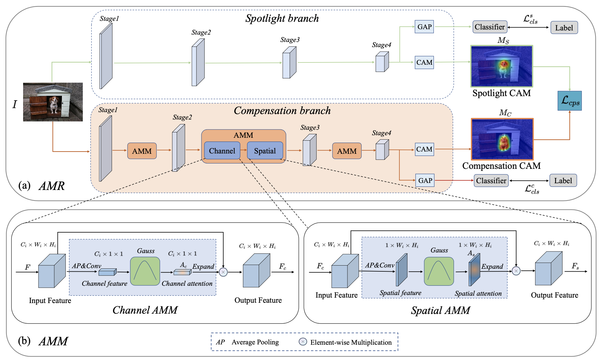
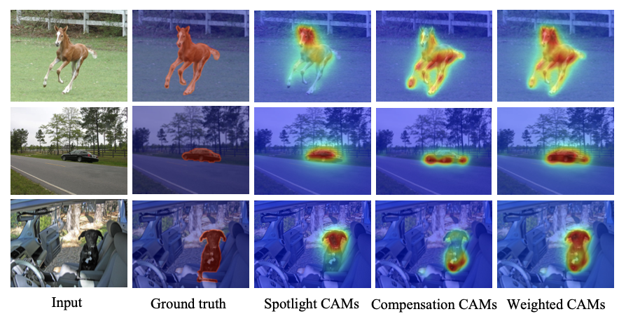

# Activation Modulation and Recalibration Scheme for Weakly Supervised Semantic Segmentation

This repository contains the pytorch codes and trained models described in the AAAI2022 paper ["Activation Modulation and Recalibration Scheme for Weakly Supervised Semantic Segmentation"](https://arxiv.org/abs/2112.08996)

## Overview



## Performance



## Prerequisites

* Linux
* python 3.8
* pytorch 1.8.1
* torchvision 0.9.1
* NVIDIA GPU
* CUDA 11.1

## Preparation

#### Dependencies

```
pip install -r requirements.txt
```

#### Dataset

Download PASCAL VOC 2012 follwing instructions in http://host.robots.ox.ac.uk/pascal/VOC/voc2012/#devkit.

## Pretrained model

The pretrained model can be download in [link](https://pan.baidu.com/s/1Ii4WsQAy5mEJHes1XFeIxQ).
Extraction code: cpul.

## Run

```
python run_sample.py --train_amr_pass True --make_cam_pass True --eval_cam_pass True
```

### Eval

```
python run_sample.py --make_cam_pass True --eval_cam_pass True
```
